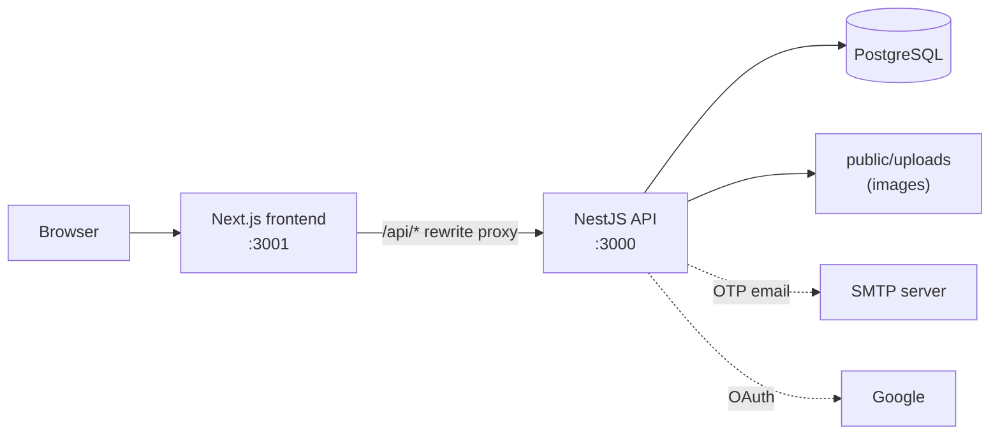
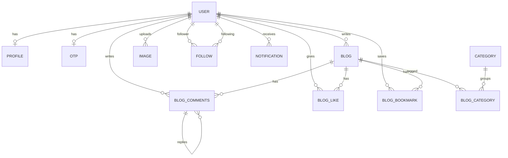

# Virgool

A full-stack blogging platform inspired by [Virgool](https://virgool.io): passwordless authentication, a rich-text editor, a draft → publish workflow, nested comments with moderation, social features (follow, like, bookmark), in-app notifications and an admin panel.

The **backend** (NestJS + PostgreSQL) is the core of the project and was written by hand. The **frontend** (Next.js) was built with AI assistance to consume the API.

<!-- Replace with a real screenshot/GIF of the home feed -->
<!--  -->

---

## Table of Contents

- [Features](#features)
- [Tech Stack](#tech-stack)
- [Architecture](#architecture)
- [Database Schema](#database-schema)
- [Security & Reliability Details](#security--reliability-details)
- [API Overview](#api-overview)
- [Getting Started](#getting-started)
- [Environment Variables](#environment-variables)
- [Testing](#testing)
- [Project Structure](#project-structure)
- [Known Limitations & Roadmap](#known-limitations--roadmap)
- [Screenshots](#screenshots)

---

## Features

**Authentication**
- Passwordless login/registration with a one-time code (OTP) via email, phone number or username
- Google OAuth 2.0 sign-in
- JWT access tokens, role-based access control (`admin` / `user`), blocked-user handling

**Blogging**
- Rich-text editor (Tiptap) with image upload
- Draft → Published workflow (drafts are private to the author and admins)
- Categories, slugs (Unicode-aware, collision-safe), estimated reading time
- Public feed with pagination, category filter and search (title + description)
- Random suggested posts on each article page

**Social**
- Follow / unfollow, followers & following lists, public author profiles
- Like and bookmark toggles, "saved posts" page
- Nested comments (up to 3 levels) with edit, delete and admin/author moderation (accept / reject)
- In-app notifications: follow, like, comment, reply, comment accepted / rejected, with unread counter and mark-as-read

**Account**
- Profile editing (nickname, bio, avatar, cover, social links)
- Change email / phone / username (email and phone require OTP verification of the new value)
- Self-service account deletion with username confirmation and uploaded-file cleanup

**Admin panel**
- User directory with search and role filter, block / unblock users
- Category management
- Comment moderation queue

---

## Tech Stack

| Layer | Technology |
|---|---|
| Backend | Node.js, **NestJS 11**, TypeScript |
| Database | **PostgreSQL**, TypeORM |
| Auth | JWT (`@nestjs/jwt`), Passport (Google OAuth 2.0), cookie-parser |
| Validation | `class-validator`, `class-transformer` (global strict `ValidationPipe`) |
| Protection | `@nestjs/throttler` (global rate limit), custom DB-backed OTP limits |
| Uploads | Multer (disk storage) |
| Email | Nodemailer (SMTP) |
| API docs | Swagger / OpenAPI |
| Backend tests | Jest, Supertest (integration tests against real PostgreSQL) |
| Frontend | **Next.js 16** (App Router), React 19, Tailwind CSS 4 |
| Frontend libs | Tiptap, Zustand, Axios, react-hot-toast, DOMPurify |
| Frontend tests | Vitest, Testing Library |

---

## Architecture



The backend follows NestJS's modular architecture. Each feature is a self-contained module with its controller, service, DTOs and entities:

```
AppModule
├── AuthModule          OTP login/register, Google OAuth, tokens, guards
├── UserModule          profile, follow, block, change email/phone/username, account deletion
├── BlogModule          blogs, likes, bookmarks, comments
├── CategoryModule      categories (admin-managed)
├── ImageModule         editor image uploads
├── NotificationModule  in-app notifications
└── OtpDeliveryModule   pluggable OTP delivery (SMTP / dev console)
```

Cross-cutting pieces live in `src/common`: guards, decorators, the validation pipe, pagination helpers, upload interceptor and shared enums.

---

## Database Schema



Blog ↔ Category is many-to-many through `blog_category`. Comments are self-referencing (`parentId`) to support replies. Deleting a user cascades to their blogs, comments, likes, bookmarks, follows, images and received notifications through `ON DELETE CASCADE`; notifications where the user was only the actor are kept with `actorId` set to `NULL`.

---

## Security & Reliability Details

These are the parts of the backend that received the most design attention:

- **OTP abuse protection**
  - Max **3 OTP requests per 10 minutes** per account, enforced with a single conditional SQL `UPDATE` (atomic, race-safe, no Redis needed)
  - Max **5 failed verification attempts** per code, after which the code is invalidated
  - Codes are **single-use**: consumption is an atomic conditional `UPDATE`, so the same code can never be exchanged for two tokens, even with concurrent requests
  - Codes expire after 2 minutes; issuing a new code invalidates the previous one
  - The code is never returned in an HTTP response or written to an application log; it leaves the server only through the delivery transport
- **Pluggable OTP delivery** – SMTP in any environment when configured; a console transport for local development only; in production with no transport configured the request fails safely instead of leaking the code
- **Authorization** – ownership is always derived from the loaded database row, never from client input (IDOR/BOLA protection on blogs, comments, images, notifications); admins may moderate
- **Draft privacy** – non-published posts return `404` (not `403`) to everyone except the author and admins, so their existence is not revealed; drafts never appear in the feed, search or suggestions
- **Strict input validation** – a single global `ValidationPipe` with `whitelist`, `forbidNonWhitelisted` and `transform` (mass-assignment hardening), shared between production and tests
- **Search safety** – `LIKE` wildcards (`%`, `_`, `\`) in user input are escaped and all queries are parameter-bound
- **Rate limiting** – global per-IP throttling (default 100 requests / 60 s, configurable via env), independent from the stricter OTP limits
- **Safe uploads** – extension whitelist, MIME check and 5 MB size limit; filesystem deletions are confined to the `public/` directory
- **Account deletion** – runs in one transaction, refuses to delete the last remaining admin, and removes files from disk only after the commit succeeds (best-effort, never fails the request)
- **Notifications are non-blocking** – a failed notification never fails the like / follow / comment that triggered it; repeatable events (like, follow) are de-duplicated while unread
- **No N+1 on feeds** – per-viewer `isLiked` / `isBookmarked` flags for a whole page are loaded with one query each

---

## API Overview

Interactive documentation (Swagger UI) is available at `http://localhost:3000/swagger` once the backend is running.

| Area | Endpoints |
|---|---|
| **Auth** | `POST /auth/user-existence` · `POST /auth/check-otp` · `GET /auth/check-login` · `GET /auth/google` · `GET /auth/google/redirect` |
| **Blog** | `GET /blog` · `GET /blog/by-slug/:slug` · `POST /blog` · `GET /blog/my` · `PUT /blog/:id` · `DELETE /blog/:id` · `POST /blog/:id/publish` |
| **Like / Bookmark** | `GET /blog/like/:id` · `GET /blog/bookmark/:id` · `GET /blog/bookmark/my` |
| **Comments** | `POST /blog-comment` · `GET /blog-comment` *(admin)* · `PUT /blog-comment/:id` · `DELETE /blog-comment/:id` · `PUT /blog-comment/accept/:id` · `PUT /blog-comment/reject/:id` |
| **User** | `GET /user/profile` · `PUT /user/profile` · `GET /user/by-username/:username` · `GET /user/followers` · `GET /user/following` · `GET /user/follow/:id` · `PATCH /user/change-email` · `POST /user/verify-email-otp` · `PATCH /user/change-phone` · `POST /user/verify-phone-otp` · `PATCH /user/change-username` · `DELETE /user/account` |
| **Admin** | `GET /user/list` · `POST /user/block` · `POST/PATCH/DELETE /category` |
| **Category** | `GET /category` · `GET /category/:id` |
| **Image** | `POST /image` · `GET /image` · `GET /image/:id` · `DELETE /image/:id` |
| **Notification** | `GET /notification` · `GET /notification/unread-count` · `PATCH /notification/read-all` · `PATCH /notification/:id/read` |

Protected routes expect an `Authorization: Bearer <token>` header.

---

## Getting Started

### Prerequisites

- Node.js 20+ (Node 22 recommended)
- PostgreSQL 14+
- npm

### 1. Clone and install

```bash
git clone https://github.com/AMIRHOSSEIN802/Virgool.git
cd Virgool

# backend dependencies
npm install

# frontend dependencies
cd frontend && npm install && cd ..
```

### 2. Create the database

```bash
createdb virgool
```

### 3. Configure environment

Create a `.env` file in the **repository root** (see [Environment Variables](#environment-variables)):

```env
PORT=3000

DB_HOST=localhost
DB_PORT=5432
DB_NAME=virgool
DB_USERNAME=postgres
DB_PASSWORD=your_password

COOKIE_SECRET=change-me
OTP_TOKEN_SECRET=change-me
ACCESS_TOKEN_SECRET=change-me
EMAIL_TOKEN_SECRET=change-me
PHONE_TOKEN_SECRET=change-me

# Required at startup by the Google strategy (use real values to enable Google login)
GOOGLE_CLIENT_ID=your-google-client-id
GOOGLE_SECRET_ID=your-google-client-secret
```

### 4. Run

```bash
# backend + frontend together
npm run dev

# or separately
npm run start:dev                 # API      → http://localhost:3000
npm run frontend:dev              # Frontend → http://localhost:3001
```

- Swagger UI: http://localhost:3000/swagger
- In **development**, if `SMTP_HOST` is not set, OTP codes are printed in the backend console (`[virgool:otp] ... code=12345`) instead of being sent.
- The database schema is created automatically on first run.

### Creating an admin

New users get the `user` role. To create an admin, update the role directly in the database:

```sql
UPDATE "user" SET role = 'admin' WHERE username = 'your_username';
```

### Production build

```bash
npm run build && npm run start:prod
cd frontend && npm run build && npm run start
```

In production you **must** configure SMTP (otherwise OTP delivery fails by design) and set `NODE_ENV=production`.

---

## Environment Variables

### Backend (`.env` in the repository root)

| Variable | Required | Description |
|---|---|---|
| `PORT` | yes | API port |
| `DB_HOST`, `DB_PORT`, `DB_NAME`, `DB_USERNAME`, `DB_PASSWORD` | yes | PostgreSQL connection |
| `COOKIE_SECRET` | yes | Secret for signed cookies |
| `OTP_TOKEN_SECRET` | yes | Signs the short-lived OTP session token |
| `ACCESS_TOKEN_SECRET` | yes | Signs access tokens |
| `EMAIL_TOKEN_SECRET`, `PHONE_TOKEN_SECRET` | yes | Sign change-email / change-phone tokens |
| `GOOGLE_CLIENT_ID`, `GOOGLE_SECRET_ID` | yes | Google OAuth credentials |
| `SMTP_HOST` | no | Enables real email delivery of OTP codes |
| `SMTP_PORT` | no | Default `587` |
| `SMTP_SECURE` | no | `true` for TLS (implied on port 465) |
| `SMTP_USER`, `SMTP_PASS` | no | SMTP credentials |
| `SMTP_FROM` | no | Sender address |
| `RATE_LIMIT_TTL_MS` | no | Global rate-limit window in ms (default `60000`) |
| `RATE_LIMIT_MAX` | no | Max requests per window per IP (default `100`) |
| `NODE_ENV` | no | Set to `production` to disable the dev console OTP transport |

### Frontend (`frontend/.env.local`, optional)

| Variable | Default | Description |
|---|---|---|
| `BACKEND_ORIGIN` | `http://localhost:3000` | Backend origin used by the `/api` rewrite proxy and image optimizer |
| `NEXT_PUBLIC_API_ORIGIN` | `http://localhost:3000` | Public API origin used by the client |

---

## Testing

The backend has **80 tests** across 7 suites (auth/OTP, rate limiting, request validation, publish workflow, account deletion, OTP delivery). They are integration tests that run against a **real PostgreSQL** instance, using isolated schemas so your development data is never touched.

```bash
# PostgreSQL must be running and reachable with the credentials in .env
npm run test            # all backend tests
npm run test:cov        # with coverage
npm run lint            # ESLint

# frontend
cd frontend && npm test # Vitest
```

---

## Project Structure

```
Virgool/
├── src/
│   ├── main.ts
│   ├── config/                 # TypeORM + Swagger config
│   ├── common/
│   │   ├── decorators/         # @SkipAuth, @CanAccess, @AllowBlocked, ...
│   │   ├── enums/              # messages, roles, entity names
│   │   ├── interceptor/        # file upload interceptor
│   │   ├── middleware/         # optional-auth middleware for public routes
│   │   ├── pipes/              # global validation pipe
│   │   └── utils/              # pagination, cookies, multer, slug helpers
│   └── modules/
│       ├── auth/               # OTP + Google login, tokens, guards
│       ├── user/               # profile, follow, account management
│       ├── blog/               # blog, comment, like, bookmark
│       ├── category/
│       ├── image/
│       ├── notification/
│       └── otp-delivery/       # SMTP / console transports
├── frontend/
│   └── src/
│       ├── app/                # Next.js App Router pages ((auth), (main), admin)
│       ├── components/         # ui, blog, comment, profile, layout, admin
│       ├── services/           # API clients
│       ├── stores/             # Zustand stores
│       └── hooks/, lib/, types/
├── scripts/                    # one-off SQL maintenance scripts
└── test/                       # e2e test setup
```

---

## Known Limitations & Roadmap

Being upfront about what is not finished yet:

- [ ] **Database migrations** – the schema currently relies on TypeORM `synchronize`; migrations should replace it before any real deployment
- [ ] **Docker / docker-compose** and a `.env.example`
- [ ] **CI pipeline** (GitHub Actions running the test suite against a Postgres service)
- [ ] **Token strategy** – access tokens are long-lived and there is no refresh/revocation flow yet; planned: short-lived access token + refresh token
- [ ] **SMS delivery** – the phone-number OTP channel has no SMS provider wired yet (only email/SMTP is implemented)
- [ ] **Google OAuth URLs** are hard-coded to `localhost` and need to become configurable
- [ ] **Transactions** for multi-step writes (e.g. creating a blog with its categories)
- [ ] Broader test coverage (comments, notifications, follow/like flows) and more frontend tests

---

## Screenshots

> Add your own images under `docs/screenshots/` and uncomment the lines below.

<!--
| Home feed | Article page |
|---|---|
|  |  |

| Editor | Admin panel |
|---|---|
|  |  |

| Notifications | Profile |
|---|---|
|  |  |
-->

---

## Author

**AmirHossein Balali** – Backend Developer
GitHub: [@AMIRHOSSEIN802](https://github.com/AMIRHOSSEIN802)
